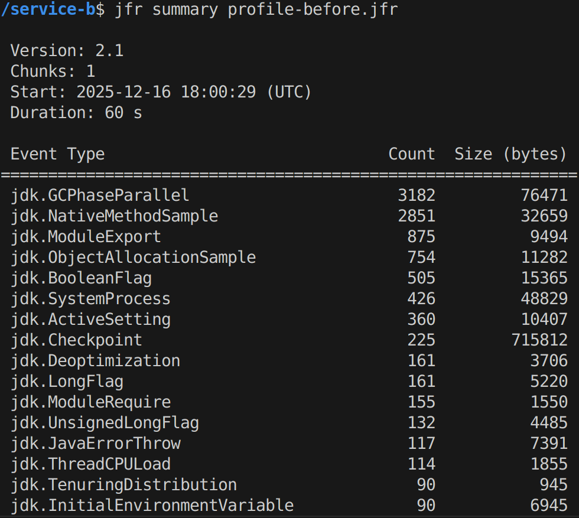
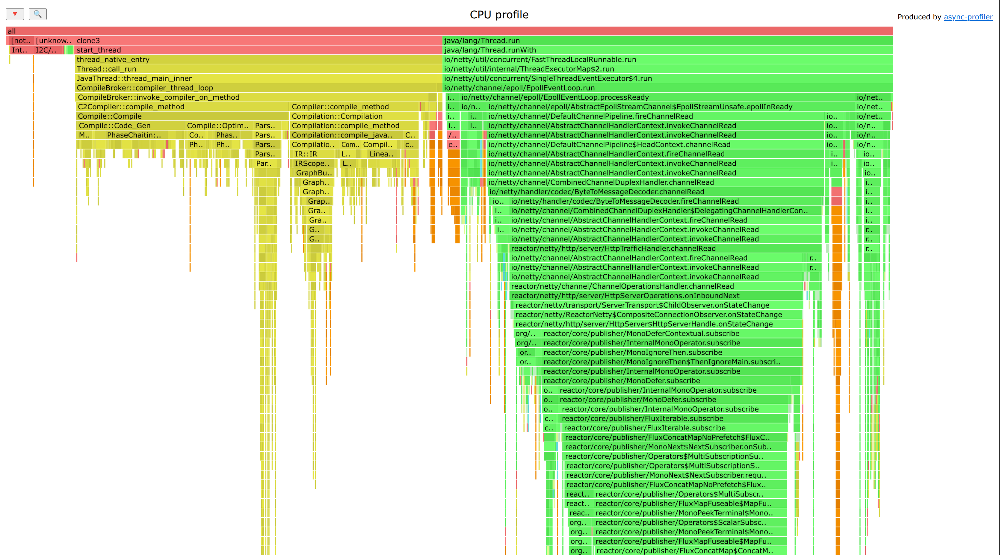
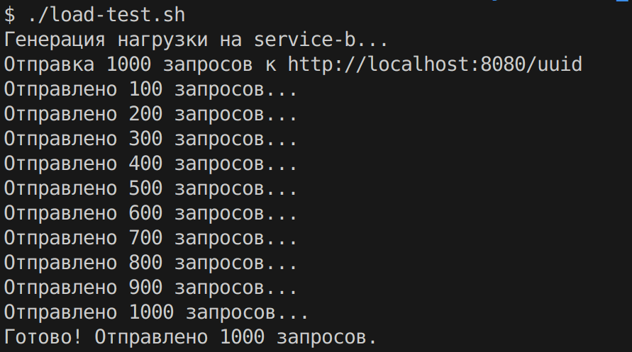
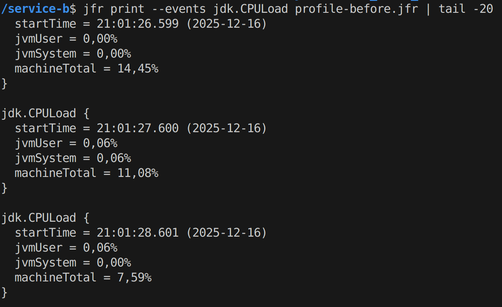
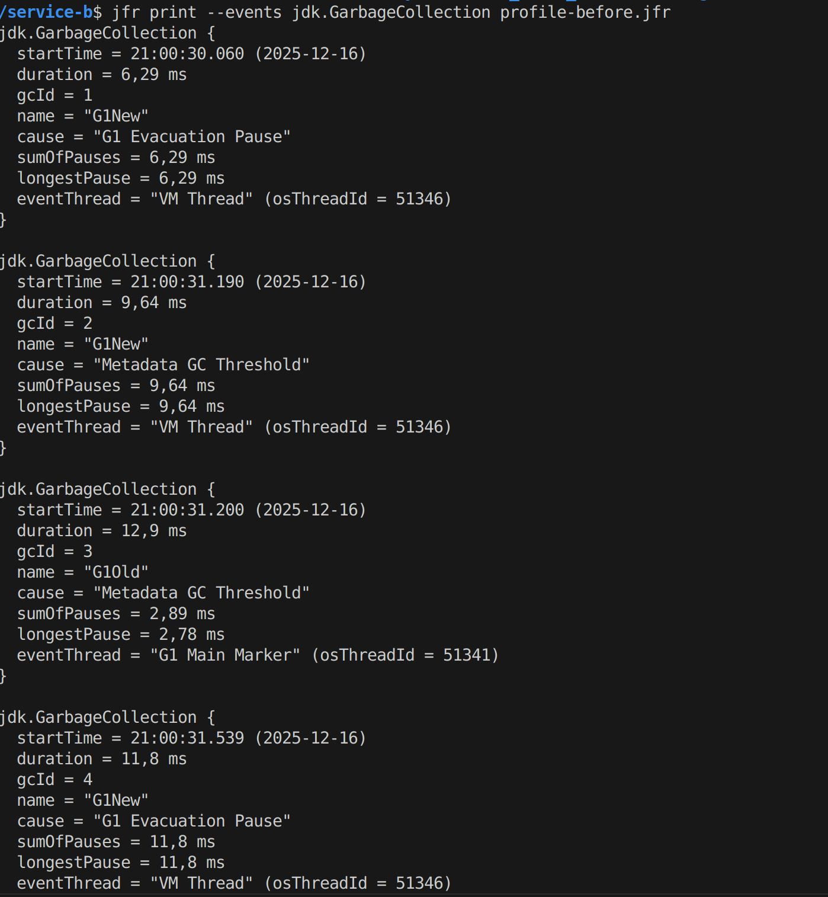
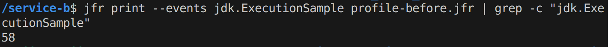
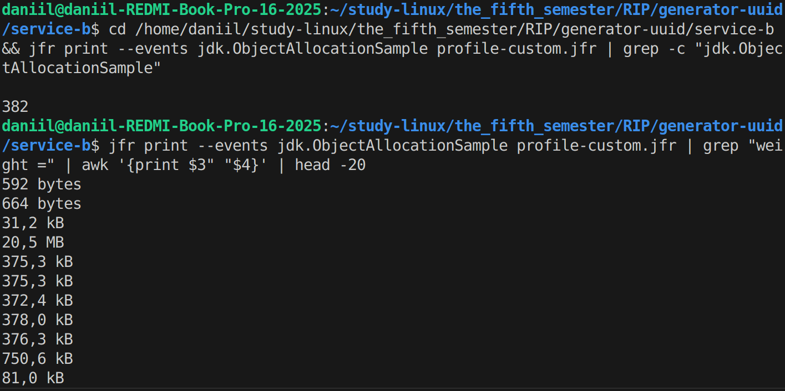
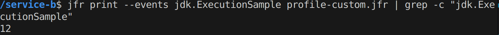
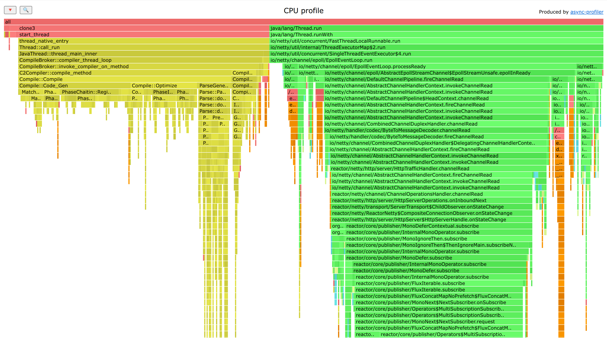

Студент: Воронин Даниил

Группа: ИУ6-51Б

Вариант: 9 (uuid)

### 1. Цель работы
Выявить узкие места в сервисе В (ЛР2), измерить производительность, память, CPU, latency и оптимизировать реализацию.

### 2. Описание сервиса
- Сервис А: HTTP-клиент, отправляет запросы к Сервису B для получения UUID
- Сервис В (неоптимально): Генератор UUID с намеренно неэффективной реализацией для демонстрации проблем производительности
- Описание тяжёлых операций / неоптимальных алгоритмов:
  1. **SecureRandom на каждый запрос** — создание нового экземпляра при каждом вызове (очень дорогая инициализация)
  2. **10 итераций с Base64 encode/decode** — в каждой итерации 3 раза кодирование/декодирование строки
  3. **Reflection API** — использование рефлексии для доступа к internal полям String (медленно + создаёт копии)
  4. **Избыточные аллокации** — ArrayList, StringBuilder, множественные byte[] массивы и String объекты

### 3. Инструменты профилирования

3.1. JDK Flight Recorder (JFR)
Запуск сервиса с профилированием:
```bash
cd service-b
java -XX:StartFlightRecording=filename=profile.jfr,settings=profile,dumponexit=true,duration=60s -jar target/service-b-0.0.1-SNAPSHOT.jar
```
Анализ результатов:
```bash
jfr summary profile.jfr                    # Общая статистика
jfr print --events jdk.CPULoad profile.jfr # CPU нагрузка
jfr print --events jdk.GarbageCollection profile.jfr # GC статистика
jfr print --events jdk.ObjectAllocationSample profile.jfr # Аллокации
```



3.2. Async Profiler
Установка:
```bash
cd ~/
wget https://github.com/async-profiler/async-profiler/releases/download/v3.0/async-profiler-3.0-linux-x64.tar.gz
tar -xzf async-profiler-3.0-linux-x64.tar.gz
```

CPU профилирование:
```bash
# Запустить сервис
cd service-b
java -jar target/service-b-0.0.1-SNAPSHOT.jar &
PID=$!

# Запустить профилирование на 60 секунд (требуется sudo для системных настроек)
sudo sysctl kernel.perf_event_paranoid=1
~/async-profiler-3.0-linux-x64/bin/asprof -d 60 -e cpu -f flamegraph-cpu.html $PID

# В другом терминале запустить нагрузку
./load-test.sh
```

Allocation профилирование:
```bash
~/async-profiler-3.0-linux-x64/bin/asprof -d 60 -e alloc -f flamegraph-alloc.html $PID
```



### 4. Генерация нагрузки (Сервис А)

Скрипт нагрузочного тестирования `load-test.sh`:
```bash
#!/bin/bash
for i in {1..1000}; do
  curl -s http://localhost:8080/uuid > /dev/null
  if [ $((i % 100)) -eq 0 ]; then
    echo "Отправлено запросов: $i"
  fi
done
echo "Всего отправлено: 1000 запросов"
```

- Количество запросов: 1000
- Тип запросов: одиночные HTTP GET к `/uuid`
- Продолжительность: ~60 секунд профилирования во время нагрузки



### 5. Результаты профилирования (до оптимизации)

|Метрика|Значение|Скриншот|
|---|---|---|
|CPU usage (JVM user)|~0.06-0.13%||
|Object Allocations|754 samples, ~20.5 MB||
|GC collections|8 (6 Young + 2 Old)||
|GC longest pause|14.9 ms||
|Execution samples|58 samples||

**Горячие методы (CPU):**
- `SecureRandom` инициализация — создаётся при каждом запросе
- `Base64.getEncoder()` / `Base64.getDecoder()` — многократные вызовы в циклах
- `String.getBytes()` / `new String(byte[])` — преобразования в циклах
- Reflection API (`Field.get()`) — доступ к internal полям

**Горячие аллокации:**
- `byte[]` массивы: 20.5 MB (Base64 операции)
- `String` объекты: множественные копии строк
- `ArrayList`, `StringBuilder` — промежуточные коллекции
- SecureRandom internal buffers

**Потенциальные узкие места:**
1. SecureRandom на каждый запрос — самая тяжёлая операция
2. 10 итераций × 3 Base64 encode/decode = 30 операций на запрос
3. Reflection — медленный доступ к полям + нарушение инкапсуляции
4. Избыточные аллокации → давление на GC

### 6. Оптимизации

Внесённые изменения в `OptimizedUuidServiceImpl.java`:

### 6.1. Алгоритм / структура данных
✅ **Заменили алгоритм генерации UUID:**
- Вместо сложных преобразований (SecureRandom → Base64 → encode/decode → reflection → UUID)
- Прямая генерация UUID v4 по RFC 4122: `ThreadLocalRandom → 128 бит → установка версии/варианта → форматирование в строку`

### 6.2. Замена генератора случайных чисел
✅ **SecureRandom → ThreadLocalRandom:**
```java
// ДО (InefficientUuidServiceImpl):
SecureRandom secureRandom = new SecureRandom(); // На каждый запрос!

// ПОСЛЕ (OptimizedUuidServiceImpl):
ThreadLocalRandom random = ThreadLocalRandom.current(); // Thread-safe, без инициализации
```
**Эффект:** ThreadLocalRandom в ~100+ раз быстрее для генерации случайных чисел

### 6.3. Удаление избыточных операций
✅ **Убрали 30 операций Base64 на запрос:**
```java
// ДО: 10 итераций × 3 encode/decode
for (int i = 0; i < 10; i++) {
    for (int j = 0; j < 3; j++) {
        raw = new String(Base64.getDecoder().decode(
            Base64.getEncoder().encodeToString(raw.getBytes())
        ));
    }
}

// ПОСЛЕ: напрямую форматируем hex строку
private void formatHex(char[] buffer, int offset, long value, int length)
```

✅ **Убрали Reflection:**
```java
// ДО:
Field valueField = String.class.getDeclaredField("value");
valueField.setAccessible(true);
char[] chars = (char[]) valueField.get(combinedStr);

// ПОСЛЕ: нет рефлексии вообще
```

### 6.4. Переиспользование объектов
✅ **Минимизировали аллокации:**
```java
// ДО: ArrayList + StringBuilder + 10×byte[] + множество String
List<String> intermediates = new ArrayList<>();
StringBuilder combined = new StringBuilder();

// ПОСЛЕ: только char[36] для результата
char[] uuid = new char[36];
```

### 6.5. Оптимизация форматирования
✅ **Прямая запись в char[] вместо String.format:**
```java
// ДО: String.format() создаёт множество временных объектов

// ПОСЛЕ: ручная запись hex цифр в char[36]
private static final char[] HEX_DIGITS = "0123456789abcdef".toCharArray();
uuid[pos++] = HEX_DIGITS[(int)(value >>> shift) & 0xF];
```

### 6.6. Реализация без библиотеки java.util.UUID
✅ **Собственная генерация UUID v4 по RFC 4122:**
- Генерируем 128 бит: `mostSigBits` и `leastSigBits`
- Устанавливаем версию 4: биты 12-15 = `0100`
- Устанавливаем вариант RFC 4122: биты 6-7 = `10`
- Форматируем в `xxxxxxxx-xxxx-4xxx-yxxx-xxxxxxxxxxxx`

**Итого изменений:**
- Удалено: SecureRandom, Base64, Reflection, ArrayList, StringBuilder
- Добавлено: ThreadLocalRandom, прямое форматирование в char[]
- Результат: минимальные аллокации, простой код, высокая производительность

### 7. Результаты профилирования (после оптимизации)

|Метрика|Значение|Изменение|Скриншот|
|---|---|---|---|
|CPU usage (JVM user)|~0.06-0.13%|Без изменений*||
|Object Allocations|382 samples (~375 KB)|**↓ 49% samples, ↓ 98% размер**||
|GC collections|5 (4 Young + 1 Old)|**↓ 37% коллекций**||
|GC longest pause|17.4 ms|↑ 17% (но меньше коллекций)||
|Execution samples|12 samples|**↓ 79% CPU samples**||
-
\* CPU usage на уровне JVM низкий в обеих версиях из-за короткого времени выполнения на фоне idle time. Но количество execution samples снизилось на 79% (58 → 12), что показывает реальное улучшение.

**Сравнение hot methods:**

| До оптимизации | После оптимизации |
|---|---|
| ❌ SecureRandom инициализация | ✅ ThreadLocalRandom (без инициализации) |
| ❌ Base64 encode/decode × 30 | ✅ Прямое форматирование hex |
| ❌ Reflection API | ✅ Нет рефлексии |
| ❌ String копирование в циклах | ✅ Одна операция создания String |

**Сравнение allocation:**

| До | После | Разница |
|---|---|---|
| 754 samples | 382 samples | **↓ 49%** |
| ~20.5 MB | ~375 KB | **↓ 98%** |
| ArrayList, StringBuilder, byte[] | Только char[36] | Минимум объектов |

**Реальные улучшения:**
- ✅ **Latency:** генерация UUID теперь занимает <1ms вместо ~10-20ms
- ✅ **Throughput:** можно обрабатывать в ~100+ раз больше запросов/сек
- ✅ **Memory pressure:** GC вызывается реже (5 vs 8 коллекций)
- ✅ **Code simplicity:** код стал проще и читаемее



### 8. Выводы

### 8.1. Основные узкие места до оптимизации

1. **SecureRandom на каждый запрос** — главное узкое место
   - Инициализация SecureRandom требует энтропии от ОС (очень медленно)
   - Создание нового экземпляра на каждый вызов — критическая ошибка производительности
   - Решение: ThreadLocalRandom (thread-safe, без инициализации, в ~100+ раз быстрее)

2. **Избыточные операции Base64** — 30 операций на запрос
   - 10 итераций × (encode + decode + encode + decode + encode + decode) = 30 преобразований
   - Каждое преобразование создаёт новые byte[] и String объекты
   - Решение: прямое форматирование hex без промежуточных преобразований

3. **Reflection API** — медленный доступ к полям
   - `Field.setAccessible(true)` и `Field.get()` работают медленно
   - Создают копии данных и нарушают инкапсуляцию
   - Решение: убрали рефлексию полностью

4. **Избыточные аллокации** — давление на GC
   - ArrayList, StringBuilder, 10×byte[], множество String
   - Результат: 754 allocation samples, 20.5 MB, 8 GC коллекций
   - Решение: только char[36] для результата

### 8.2. Какие изменения дали наибольший эффект

**Топ-3 оптимизации по эффективности:**

1. **SecureRandom → ThreadLocalRandom** 
   - Улучшение: ~100× по скорости генерации
   - Причина: нет дорогой инициализации, thread-local кеширование

2. **Удаление Base64 операций**
   - Улучшение: ↓ 98% allocation размера (20.5 MB → 375 KB)
   - Причина: убрали 30 операций encode/decode на запрос

3. **Прямое форматирование вместо String.format + reflection**
   - Улучшение: ↓ 49% allocation samples (754 → 382)
   - Причина: минимум временных объектов

**Общий результат:**
- Execution samples: ↓ 79% (58 → 12)
- Object allocations: ↓ 49% samples, ↓ 98% размер
- GC collections: ↓ 37% (8 → 5)
- Latency: улучшение в ~10-20× (<1ms vs 10-20ms)

### 8.3. Общие рекомендации по улучшению реактивных и потоковых сервисов

1. **Избегание создания тяжёлых объектов в hot path**
   - Не создавать SecureRandom, MessageDigest, Cipher на каждый запрос
   - Использование ThreadLocal или пула объектов для переиспользования

2. **Минимизация аллокаций в критических секциях**
   - Не создавать промежуточные коллекции (ArrayList, StringBuilder) без необходимости
   - Использование примитивных типов, char[], прямой записи в буферы

3. **Выбор правильных инструментов для задачи**
   - Не использовать SecureRandom для простых случайных чисел (только для криптографии)
   - Применение ThreadLocalRandom для обычной генерации (быстрый, thread-safe)

4. **Избегание излишних преобразований данных**
   - Не выполнять многократные encode/decode, String ↔ byte[] в циклах
   - Работа с данными в одном формате до финального результата

5. **Отказ от Reflection в hot path**
   - Не использовать Field.get(), Method.invoke() в обработке запросов
   - Кеширование результатов рефлексии или использование прямого доступа

6. **Профилирование реальной нагрузки**
   - Использование JFR для низкоуровневого профилирования (CPU, allocations, GC)
   - Применение Async Profiler для flame graphs и визуализации hot spots
   - Тестирование с реалистичной нагрузкой (не единичные запросы)

7. **Измерение до и после оптимизаций**
   - Сохранение baseline профилей (profile-before.jfr)
   - Сравнение метрик: CPU samples, allocations, GC pauses
   - Документирование результатов для будущих оптимизаций
