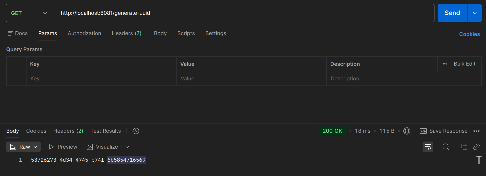

# Генератор UUID

Этот проект состоит из двух сервисов:
1. Сервис А (клиент) - отправляет запросы на генерацию UUID
2. Сервис B (сервер) - генерирует UUID с использованием неоптимальной логики

## Структура проекта

```
generator-uuid/
├── service-a/          # WebClient клиент
├── service-b/          # REST-сервис для генерации UUID
└── README.md
```

## Требования

- Java 21
- Maven 3.8.6

## Запуск сервисов

### Сервис B (сервер)

```bash
cd service-b
mvn spring-boot:run
```

Сервер будет доступен по адресу: http://localhost:8080

### Сервис A (клиент)

```bash
cd service-a
mvn spring-boot:run
```

Клиент будет доступен по адресу: http://localhost:8081

## Пример использования

```bash
curl http://localhost:8081/generate-uuid
```



## 🚫 Особенности неоптимальной реализации
- Создание SecureRandom на каждый вызов - тяжёлый объект, должен быть переиспользуем.
- Генерация 10 промежуточных строк без практической необходимости.
- Многократное кодирование/декодирование Base64 - избыточные преобразования.
- Использование рефлексии для доступа к приватному полю String.value - медленно и небезопасно.
- Избыточные операции с памятью: множественные аллокации, копирования, промежуточные объекты.
